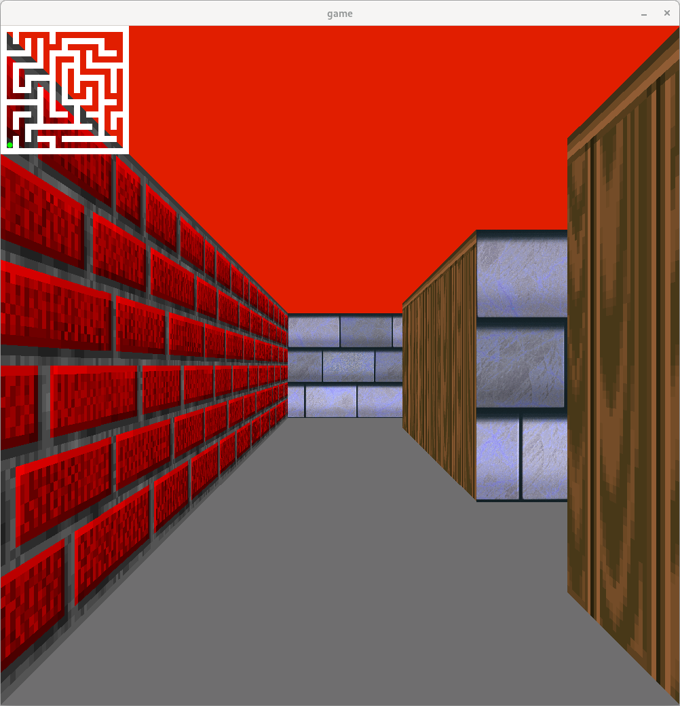

# Raycaster (Projet cub3d de 42) 

Un moteur 3D simple basé sur le **raycasting**, qui permet de naviguer dans une carte 2D et de voir l'environnement en pseudo-3D.



## lancement

```bash
git clone 
./cube3D map/map_labyrinthe.cub
